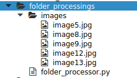
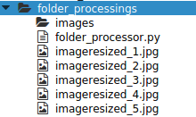
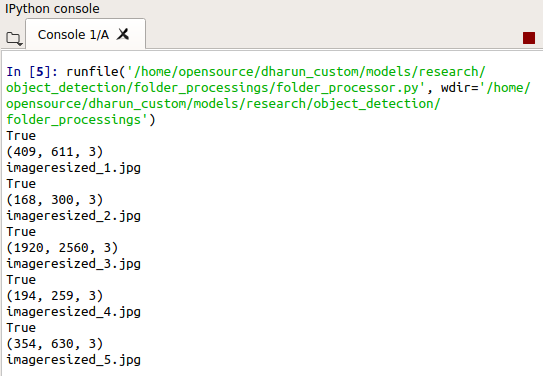

# Process-Images-In-Folder

The python script to process the set of images (which of any type such as jpg, png etc.,) in a folder. The script runs infinite that it accepts the images anytime when it pushed into folder.

### Python Packages Needed

* <a href='https://github.com/skvark/opencv-python'>openCV</a> 

### About Script

* The script just process the images from the folder, simply resizes and store the images outside the folder. The script never stops that it always open to accept the images. That means the script has a complete control of the folder.

#### Initial

  

 

#### After Processing

  

 

#### Output

* The script returns **True** that means the image file is present in the folder.
* It shows the dimensions of the picture.
* At last it shows the name in which the image is resized and stored.

  

 

### PS

* The script is useful for multiple things, If you want to process some images which comes through **FTP** and pushed in the folder then it would be neccessary to have a control of images in the folder. 
